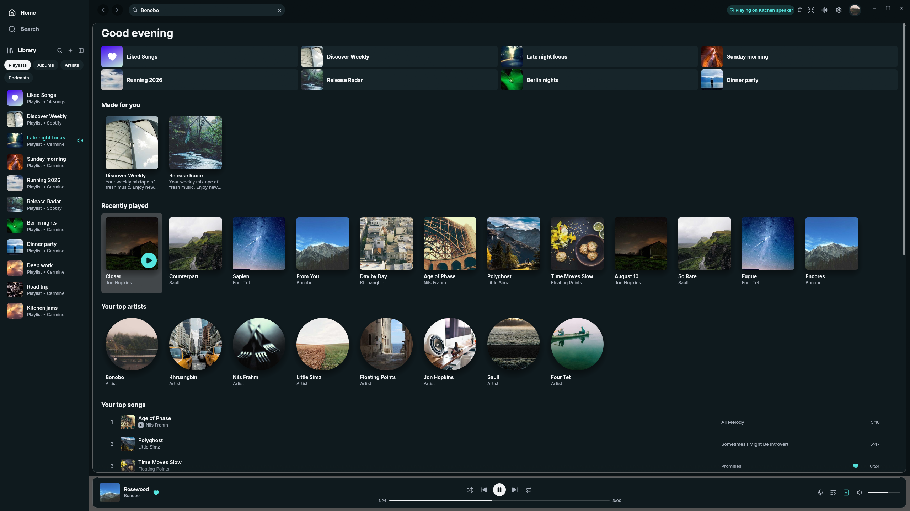
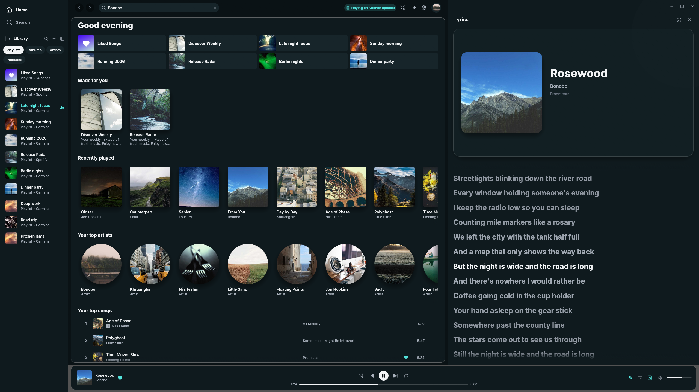

# MagicSpot

MagicSpot is a lightweight native Spotify desktop client for Windows, macOS,
and Linux. It is built with Rust, egui, and librespot, with no embedded browser
engine.

MagicSpot began as a fork of
[Fastpotify](https://github.com/crmne/fastpotify) by Carmine Paolino and is
distributed under the MIT License. It now has its own branding, application
identity, desktop layout, themes, lyrics experience, packaging, settings, and
release direction.



## Current status

MagicSpot is an early personal project. Spotify Premium is required for local
playback through librespot. MagicSpot is not affiliated with or endorsed by
Spotify.

## What is different

- A redesigned desktop shell with a full-height library rail, top navigation,
  inset content canvas, and contained player bar.
- Responsive collection headers with prominent artwork.
- A resizable lyrics panel with a large album card and no separate expand mode.
- Adjustable 20–44 pt lyric text and optional word-by-word highlighting marked
  **Beta** and disabled by default.
- Light, Dark, Follow System, and OLED appearances.
- Aqua, Violet, Rose, Amber, and Neutral Gray accents. Neutral Gray and OLED
  support album-art tinting while keeping their darker base surfaces.
- Independent MagicSpot executable, application IDs, data directories, icons,
  installers, command protocol, and built-in Winamp skin.



## Install on Windows

Download the normal setup program or portable ZIP from
[GitHub Releases](https://github.com/FallenG101/MagicSpot/releases). The setup
installs for the current user and does not require administrator rights. Builds
are currently unsigned, so Windows may ask you to confirm the publisher.

The raw `magicspot.exe` is also attached to every release.

## Install on macOS

Download the universal DMG from
[GitHub Releases](https://github.com/FallenG101/MagicSpot/releases), open it,
and drag MagicSpot into Applications. The same download supports Apple Silicon
and Intel Macs.

Current Mac builds are ad hoc signed while MagicSpot is a personal project. On
first launch, macOS may require you to Control-click MagicSpot, choose **Open**,
and confirm. Developer ID signing and Apple notarization are planned before a
public release.

Homebrew support will follow the DMG once public releases are stable. A Cask is
an alternate installation route for the same release artifact, rather than a
replacement for the DMG.

## Build on Windows

Install [Rust](https://rustup.rs/) and the Microsoft C++ Build Tools, then run
this from PowerShell in the repository:

```powershell
powershell -ExecutionPolicy Bypass -File .\build.ps1 -Release
```

The executable is written to `target/release/magicspot.exe`. Visual Studio is
not required; VSCodium works well as the editor. Omit `-Release` for a debug
build or add `-Demo` for offline sample data.

## Build on macOS or Linux

The standard lightweight build excludes the optional MilkDrop dependency:

```sh
cargo build --locked --release --no-default-features
```

Linux also needs its audio and window-system development packages. See
[Building](docs/BUILDING.md) for package names, full checks, Nix, and optional
MilkDrop requirements.

## Sign in and play

1. Start MagicSpot and select **Sign in with Spotify**. Authentication happens
   on Spotify's website; MagicSpot does not receive your password.
2. To play on this computer, open the device menu and select **Set up playback
   here**. Spotify asks for a separate playback authorization.
3. Select MagicSpot as the active Spotify Connect device.

You can optionally add your own Spotify Development Mode client ID under
**Settings → Account**. The setup button opens Spotify's developer dashboard.

See [Using MagicSpot](docs/USAGE.md) for shortcuts, lyrics controls, themes,
external commands, and stored data. [Privacy and network access](docs/PRIVACY.md)
documents every service the application contacts.

## Features

- Local playback up to 320 kbps, gapless playback, normalization, and an audio
  cache.
- Spotify Connect control for computers, phones, speakers, and compatible
  receivers discovered on the local network.
- Home, search, playlists, Liked Songs, albums, artists, podcasts, and episodes.
- Playlist creation, editing, reordering, duplicate checks, and drag and drop.
- Queue and session restoration.
- Synced lyrics with click-to-seek and automatic following.
- System media controls, tray support, keyboard navigation, and screen-reader
  metadata.
- A Winamp-compatible mini player with `.wsz` skins and an equalizer.
- Optional projectM/MilkDrop visualizations when built with default features.

## Project layout

- `src/ui/` contains views and widgets.
- `src/app.rs` owns application state and actions.
- `src/backend.rs` runs Spotify and network work away from the UI thread.
- `src/player.rs` contains librespot playback and Connect integration.
- `src/api/` contains Spotify Web API clients and routing.
- `src/lyrics.rs` and `src/ui/lyrics.rs` handle retrieval and presentation.
- `packaging/` contains MagicSpot desktop metadata and installer definitions.

## Upstream maintenance

The repository keeps
[Fastpotify](https://github.com/crmne/fastpotify) as the `upstream` Git remote.
MagicSpot carries its product and visual changes as a focused downstream layer,
while broadly useful playback, platform, performance, and API fixes can be
synced or proposed upstream independently. See
[Upstream maintenance](docs/UPSTREAM.md) for the workflow.

## Contributing

Read [CONTRIBUTING.md](CONTRIBUTING.md). The main local checks are:

```sh
cargo fmt --all --check
cargo test --locked --no-default-features --features demo --all-targets
cargo clippy --locked --no-default-features --features demo --all-targets -- -D warnings
```

## Acknowledgements and license

MagicSpot uses [Fastpotify](https://github.com/crmne/fastpotify),
[librespot](https://github.com/librespot-org/librespot),
[egui](https://github.com/emilk/egui), the Inter typeface, and Lucide icons.
See [LICENSE](LICENSE) for the MIT License and retained copyright notice.

Spotify is a trademark of Spotify AB. MagicSpot is an independent project and
is not affiliated with Spotify.
